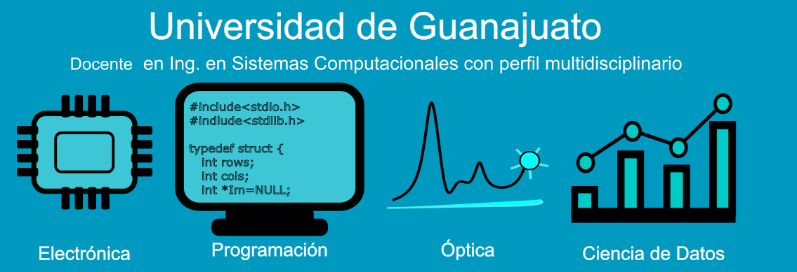

# Hola, soy Ernesto

<!--
**e-garcias/e-garcias** is a ✨ _special_ ✨ repository because its `README.md` (this file) appears on your GitHub profile.

Here are some ideas to get you started:

- 🔭 I’m currently working on ...
- 🌱 I’m currently learning ...
- 👯 I’m looking to collaborate on ...
- 🤔 I’m looking for help with ...
- 💬 Ask me about ...
- 📫 How to reach me: ...
- 😄 Pronouns: ...
- ⚡ Fun fact: ...
-->
* Tengo un perfil técnico multidisciplinario centrado en áreas tecnológicas de la Ing. Eléctrica con gusto por la programación.
* Actualmente trabajo como Docente en la Universidad de Guanajuato donde apoyo con cursos relacionados con la carrera de Sistemas Computacionales.  
* Actualmente estoy realizando el curso de Data Science con Tripleten, donde llevo alrededor del 60% de avance.
* Tengo especial interés por el procesamiento de imágenes, así como por la implementación de algoritmos de reconocimiento de patrones.
