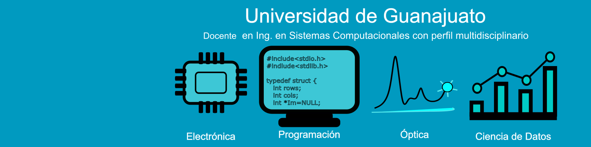

# Hola, soy Ernesto

  <b>🔭 Perfil Profesional</b>
<ul>
  <li> Tengo un perfil técnico multidisciplinario centrado en áreas tecnológicas de la Ing. Eléctrica con gusto por la programación.</li>
  <li> Actualmente trabajo como Docente en la Universidad de Guanajuato donde apoyo con cursos relacionados con la carrera de Sistemas Computacionales.</li> 
</ul>

 <b>⚡ Herramientas que manejo </b>
  <ul>
  <li> Python (y algunas de sus bibliotecas como Pandas, numpy, scipy, sympy, matplotlib, scikit-learn) </li>
  <li> Lenguaje C</li>
  <li> MATLAB </li>
  <li> Microcontroladores </li>
  <li> Octave </li>
  </ul>

 <b>🌱 Formación complementaria en proceso </b>
  <ul>
  <li> Actualmente estoy realizando el curso de Data Science con Tripleten, donde llevo alrededor del 60% de avance.</li>
  <li> Tengo especial interés por el procesamiento de señales e imágenes, así como por la implementación de algoritmos de reconocimiento de patrones.</li>
  </ul>

 <B>✨ Objetivo 2025-2026 </B>
  <ul>
  <li> Terminar mi entrenamiento como científico de datos y explotarlo en mi actividad actual.</li>
  <li> Incorporarme al mundo Tech mediante el desarrollo de proyectos orientados a Data Science y Machine Learning.</li>
  <li> Reactivar mi actividad relacionada con actividades de divulgación y publicaciones técnicas/científicas.</li>
  </ul>

  
<!--
**e-garcias/e-garcias** is a ✨ _special_ ✨ repository because its `README.md` (this file) appears on your GitHub profile.

Here are some ideas to get you started:

- 🔭 I’m currently working on ...
- 🌱 I’m currently learning ...
- 👯 I’m looking to collaborate on ...
- 🤔 I’m looking for help with ...
- 💬 Ask me about ...
- 📫 How to reach me: ...
- 😄 Pronouns: ...
-->

